<div align="center">

<a href="https://itkannagara.dev">
  
</a>

<br />

[](https://itkannagara.dev)
[](https://www.linkedin.com/in/it-kannangara)
[](mailto:thenuka322@gmail.com)
[](https://github.com/Thenuka22)


</div>

## The short version

I am **Induwara Thenuka Kannangara**, a Software Engineering undergraduate and freelance developer from Sri Lanka. I build full-stack products, agentic AI systems, automations, and data-driven applications - from the first architecture sketch to a deployed experience people can actually use.

My favorite work lives where **product engineering meets intelligent systems**: AI agents with tools and memory, dependable APIs, thoughtful interfaces, and pragmatic infrastructure.

<div align="center">

| `2+` years building | `30+` projects delivered | `3+` countries served |
|:---:|:---:|:---:|

</div>

```ts
const induwara = {
  roles: ["Full-Stack Developer", "AI Developer", "Software Engineering Undergraduate"],
  currentFocus: ["Agentic AI", "Multi-Agent Systems", "Production Web Applications"],
  principles: ["Useful over flashy", "Reliable by design", "Always keep learning"],
  openTo: ["Freelance projects", "AI collaborations", "Software engineering opportunities"],
};
```

## Selected work

<table>
<tr>
<td width="50%" valign="top">

### 01 / [Atlas](https://atlas.itkannagara.dev)

An agentic shopping platform built for the **Kapruka AI Agent Challenge**. It plans, searches, validates, optimizes bundles, remembers context, and carries the journey through checkout.

`Next.js` `TypeScript` `Gemini` `Vercel AI SDK` `Supabase` `Zod` `MCP`

[**Explore live ->**](https://atlas.itkannagara.dev)

</td>
<td width="50%" valign="top">

### 02 / [ADK-Ollama Multi-Agent Assistant](https://github.com/Thenuka22/Ollama-Multi-Agent-Workspace-with-ADK-MCP)

A local-first hybrid AI workspace: Gemini handles high-level orchestration while specialized Ollama agents plan, research, inspect files, use safe tools, and preserve session context.

`Python` `Google ADK` `Ollama` `Gemini` `MCP` `Gradio` `ReAct`

[**View source ->**](https://github.com/Thenuka22/Ollama-Multi-Agent-Workspace-with-ADK-MCP)

</td>
</tr>
<tr>
<td width="50%" valign="top">

### 03 / [Blender AI Studio Agent](https://github.com/Thenuka22/Blender-AI-Studio-Agent)

A Blender add-on and FastAPI service that turns natural-language prompts into structured 3D scenes using local Ollama models, asset presets, scene beautification, and safe execution.

`Python` `FastAPI` `Blender` `Ollama` `Pydantic`

[**View source ->**](https://github.com/Thenuka22/Blender-AI-Studio-Agent)

</td>
<td width="50%" valign="top">

### 04 / [Snapseat.lk](https://snapseat.lk)

A production event-ticketing platform with secure payment webhooks, server-side validation, Redis caching, management workflows, and a Gemini-powered support assistant.

`Full-Stack` `Redis` `Payments` `Gemini` `Secure Webhooks`

[**Visit platform ->**](https://snapseat.lk)

</td>
</tr>
<tr>
<td width="50%" valign="top">

### 05 / [Cats Defender Arcade](https://github.com/Thenuka22/Tutorial)

A SwiftUI arcade with three game modes, shared session persistence, charts, MapKit markers, score sharing, local notifications, and real settings-driven gameplay.

`Swift` `SwiftUI` `MapKit` `Swift Charts` `UserDefaults`

[**View source ->**](https://github.com/Thenuka22/Tutorial)

</td>
<td width="50%" valign="top">

### 06 / [Client platforms](https://itkannagara.dev/#projects)

Production websites and business systems for clients in Sri Lanka, Australia, and New Zealand - designed around speed, trust, discoverability, lead capture, and maintainable delivery.

[Freshco Kleen](https://freshcokleen.com.au) · [Clean & Shine](https://cleanandshine.co.nz) · [Service Station Facilities](https://servicestationfacilities.com.au) · [Emerald Charm](https://www.emeraldcharmservices.com.au)

</td>
</tr>
</table>

<details>
<summary><b>More systems I have built</b></summary>
<br />

- A hybrid online/offline event access-control system with C#/.NET, PostgreSQL, SQLite, and low-connectivity synchronization.
- An AI WhatsApp support and booking agent using n8n, structured knowledge, Google Sheets, and human handoff.
- A secured inventory desktop application with authentication, OTP verification, and PDF generation.
- An IEEE-CIS credit-card fraud detection pipeline covering preprocessing, feature engineering, model comparison, threshold tuning, and precision/recall/F1 evaluation.
- A Java and MySQL bakery ordering, sales, and inventory-management application.

</details>

## Technical toolkit

<div align="center">

#### Product & web engineering


#### Data, cloud & delivery


#### AI, machine learning & automation


</div>

## Journey

| When | Chapter |
|:--|:--|
| **2024 - present** | **Freelance Full-Stack Developer** - building and deploying responsive client products, APIs, authentication, databases, AI features, and business automations. |
| **2023 - present** | **BSc (Hons) in Computing - Software Engineering**, Coventry University UK through NIBM Colombo. |
| **2022 - 2023** | **Diploma in Software Engineering**, NIBM Colombo - GPA **3.6 / 4.0**. |

<details>
<summary><b>Certificates & continuous learning</b></summary>
<br />

- **AMD AI Academy - AI Developer Course Series** - nine courses across LLMs, multi-agent systems, and AI infrastructure.
- **Meta Front-End Developer Professional Certificate** - Coursera.
- **Apache Airflow 3 Fundamentals** - Astronomer Academy.
- **AWS Cloud Technical Essentials** - Coursera.
- **Google UX Design Certificate** - Coursera.
- **AI/ML Engineer - Stage 1** - SLIIT.

</details>

## GitHub pulse

<div align="center">


<picture>
  <source media="(prefers-color-scheme: dark)" srcset="https://raw.githubusercontent.com/Thenuka22/Thenuka22/output/github-contribution-grid-snake-dark.svg" />
  <source media="(prefers-color-scheme: light)" srcset="https://raw.githubusercontent.com/Thenuka22/Thenuka22/output/github-contribution-grid-snake.svg" />
  
</picture>

</div>

## Away from the keyboard

I have been part of the **Sumedha College Robotics Club**, and I am a former competitive badminton and cricket player across U13, U15, and U17 teams. Both shaped how I work today: stay curious, practice deliberately, and be useful to the team.

## Let us build something useful

I am open to freelance builds, AI collaborations, and software engineering opportunities. If the idea needs a thoughtful interface, a reliable backend, or an AI system that goes beyond a demo, I would love to hear about it.

<div align="center">

[](https://itkannagara.dev)
[](https://www.linkedin.com/in/it-kannangara)
[](mailto:thenuka322@gmail.com)

<sub>Designed with intention by Induwara Kannangara · Gampaha, Sri Lanka</sub>

</div>

